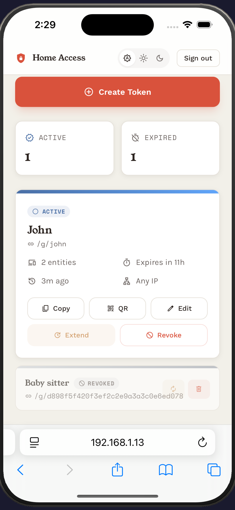
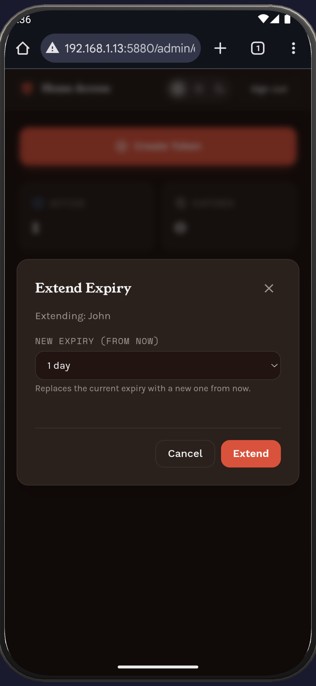
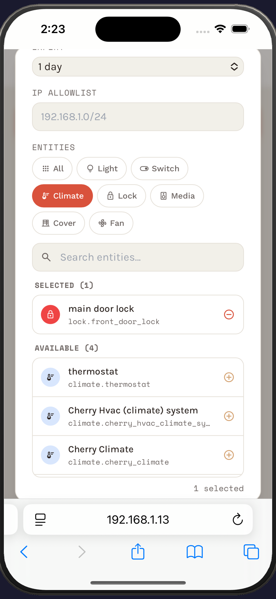
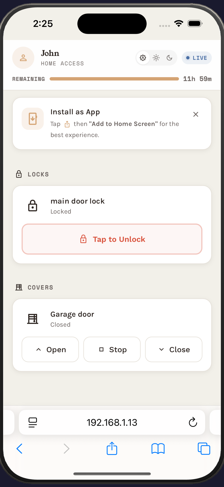

# HAPass

[](LICENSE)

**A Home Assistant Guest Access Proxy**

HAPass gives guests temporary, scoped control of your Home Assistant devices
through a mobile-friendly PWA — no HA accounts, no app installs, just a
shareable link. Admins create time-limited tokens that expose only the entities
they choose.

## Screenshots

<p align="center">
  
  
  
  
</p>

## Features

- **Scoped guest tokens** — each token grants access to a specific set of entities
- **Time-limited access** — tokens auto-expire after a configurable duration
- **Real-time updates** — SSE-powered live state changes with automatic reconnect
- **Installable PWA** — guests can add it to their home screen for an app-like experience
- **Dark mode** — system-aware with manual override
- **Admin dashboard** — create, revoke, extend, and monitor tokens from the browser
- **Service allowlist** — only safe services (toggle, set_temperature, etc.) are permitted
- **Rate limiting** — 30 req/min per token to prevent abuse
- **IP allowlisting** — optionally restrict tokens to specific CIDRs
- **Offline shell** — service worker caches the UI for instant loads

## Quick Start

### Docker Compose (recommended)

```yaml
services:
  ha-pass:
    image: ghcr.io/rohithkadaveru/ha-pass:latest
    restart: unless-stopped
    ports:
      - 5880:5880
    volumes:
      - ./data:/data
    environment:
      - ADMIN_USERNAME=admin
      - ADMIN_PASSWORD=changeme
      - HA_BASE_URL=http://homeassistant.local:8123
      - HA_TOKEN=your_long_lived_token_here
```

```bash
docker compose up -d
```

### Docker Run

```bash
docker run -d --restart unless-stopped \
  -p 5880:5880 \
  -v ./data:/data \
  -e ADMIN_USERNAME=admin \
  -e ADMIN_PASSWORD=changeme \
  -e HA_BASE_URL=http://homeassistant.local:8123 \
  -e HA_TOKEN=your_long_lived_token_here \
  ghcr.io/rohithkadaveru/ha-pass:latest
```

The admin dashboard is at `http://localhost:5880/admin/dashboard`.

> **Note:** You'll need a [long-lived access token](https://developers.home-assistant.io/docs/auth_api/#long-lived-access-token) from Home Assistant. Create one in your HA profile under **Security → Long-Lived Access Tokens**.

## Configuration

All configuration is via environment variables (`.env` file):

| Variable | Description | Required | Default |
|---|---|---|---|
| `ADMIN_USERNAME` | Admin login username | Yes | — |
| `ADMIN_PASSWORD` | Admin login password | Yes | — |
| `HA_BASE_URL` | Home Assistant base URL | Yes | — |
| `HA_TOKEN` | HA long-lived access token | Yes | — |
| `DB_PATH` | SQLite database path | No | `/data/db.sqlite` |
| `APP_NAME` | User-facing app name | No | `Home Access` |
| `CONTACT_MESSAGE` | Message shown on expired pages | No | `Please request a new link from the person who shared this one.` |
| `ACCESS_LOG_RETENTION_DAYS` | Days to retain access logs before cleanup | No | `90` |
| `BRAND_BG` | Background color for PWA theme | No | `#F2F0E9` |
| `BRAND_PRIMARY` | Primary/accent color | No | `#D9523C` |

## Supported Entity Types

| Domain | Allowed Services |
|---|---|
| `light` | `turn_on`, `turn_off`, `toggle` |
| `switch` | `turn_on`, `turn_off`, `toggle` |
| `input_boolean` | `turn_on`, `turn_off`, `toggle` |
| `climate` | `set_temperature`, `set_hvac_mode`, `turn_on`, `turn_off` |
| `lock` | `lock`, `unlock` |
| `media_player` | `media_play`, `media_pause`, `media_stop`, `volume_set`, `media_play_pause`, `turn_on`, `turn_off` |
| `cover` | `open_cover`, `close_cover`, `stop_cover` |
| `fan` | `turn_on`, `turn_off`, `toggle`, `set_percentage` |

## Security Considerations

- **Reverse proxy recommended for IP allowlists.** If you use IP allowlists, deploy behind a reverse proxy that overwrites `X-Forwarded-For` with the true client IP. For local-only use without IP allowlists, direct access is fine.

## Architecture

```
Browser (Guest PWA)
    │
    ├── GET  /g/{slug}          → PWA shell (HTML)
    ├── GET  /g/{slug}/state    → initial entity states
    ├── GET  /g/{slug}/stream   → SSE real-time updates
    └── POST /g/{slug}/command  → service call proxy
                                      │
                                      ▼
                                  HAPass
                                  (FastAPI)
                                      │
                                      ├── REST API → Home Assistant
                                      └── WebSocket → HA event bus
```

## Disclaimer

HAPass is not affiliated with, endorsed by, or associated with Home Assistant
or Nabu Casa Inc. "Home Assistant" is a trademark of Nabu Casa Inc.

## License

[MIT](LICENSE)
